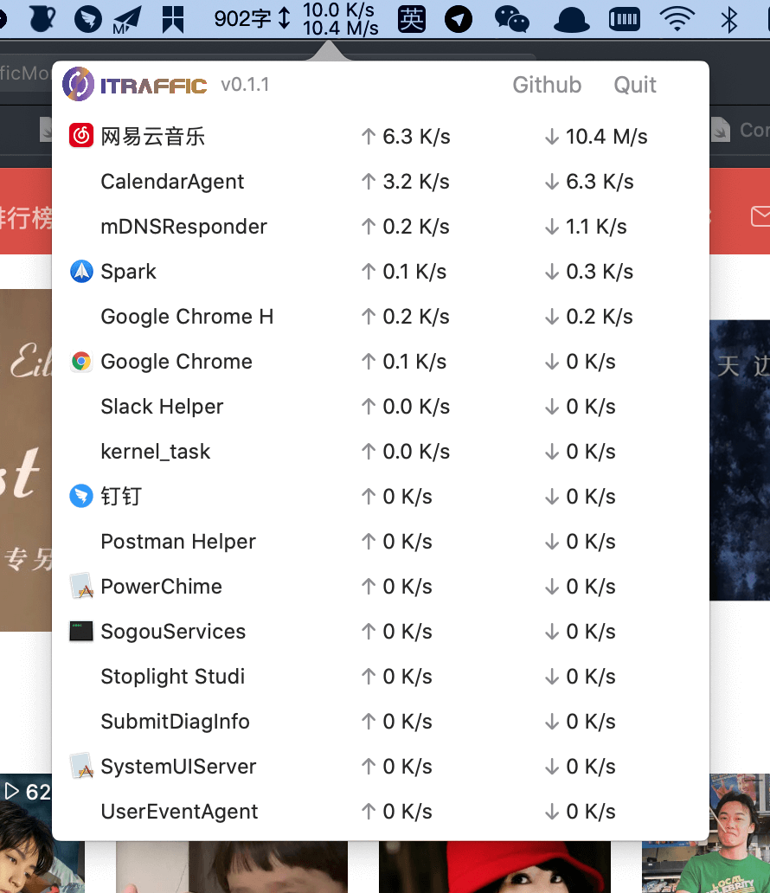

<div align="center">

## 核心功能

iTraffic 只专注做好一件事：实时显示当前是哪些进程在占用你的网络。

- 按进程实时显示上传 / 下载速度
- 原生 macOS 菜单栏界面，浅色 / 深色模式自适应
- 直接驱动系统 `nettop`，无需额外打包二进制
- Delta 模式采样，实时速率更准确
- 本地 SQLite 历史流量记录，附可视化仪表盘
- 数据支持 CSV / JSON 导出

## 菜单栏实时监控

- **状态栏速率**：菜单栏常驻显示实时上传（↗）与下载（↙）速率，无需打开窗口即可随时查看。
- **进程列表**：点击菜单栏图标弹出进程列表，每个进程显示应用图标、名称以及上传 / 下载速率。
- **活动指示条**：每行按“下载 + 上传”总量相对页面最大值的比例渲染一条活动指示条，一眼看出谁在占带宽；无流量的进程自动变暗。
- **深度休眠**：窗口不显示时自动释放弹层控制器，降低内存与 CPU 占用，长期挂在菜单栏也不会拖慢系统。

## 进程识别与归属

- **图标与名称解析**：GUI 应用直接通过 `NSRunningApplication` 获取图标与显示名。
- **命令行工具归属**：对 `node`、`python` 等无 GUI 的进程，向上回溯父进程树（最多 6 层），归属到启动它的终端或 IDE，显示为「终端名 · 原始进程名」，图标复用宿主应用。
- **稳定身份标识**：优先使用 bundle identifier 作为历史记录的稳定标识，应用改名后历史数据仍能正确合并。

## 流量采集引擎

- **纯 Swift 驱动 `nettop`**：以 CSV 增量模式调用 `/usr/bin/nettop`，替代了原先打包的 Go 辅助二进制，去掉了仅支持 x86_64 的架构限制。
- **Delta 模式采样**：使用 nettop 的 `-d` 增量模式，读取两次采样间的流量差，速率计算更准确。
- **仅统计外部接口**：只统计对外网卡的流量，局域网内流量不计入。
- **防 CPU 空转**：通过 pseudo-TTY 包装并保持 stdin 打开，避免 nettop 在无终端环境下空转占满 CPU。
- **自动重启**：采集子进程异常退出后自动重启，保证监控不中断。

## 历史记录与仪表盘

流量按“分钟分桶”写入本地 SQLite（WAL 模式），默认保留 90 天并自动清理过期数据。仪表盘窗口共 6 个标签页：

| 标签页                   | 功能                                                                                                    |
| ------------------------ | ------------------------------------------------------------------------------------------------------- |
| **Overview 概览**        | 本周总量、本月总量、月度预估（按已过天数外推）三张统计卡；最近 7 天每日流量柱状图；本月 Top 20 应用排行 |
| **Trends 趋势**          | 按应用的每日流量折线图，支持 7 天 / 30 天 / 本月三种范围，最多叠加 8 个应用                             |
| **Monthly Top 月度排行** | 本月各应用流量横向条形图                                                                                |
| **Realtime 实时**        | 最近约 10 分钟的实时总速率曲线（2 秒采样、300 样本环形缓冲），蓝色下载、橙色上传                        |
| **Heatmap 热力图**       | 小时 × 天的流量热力图，直观呈现流量高峰时段，支持 7 / 30 / 90 天                                        |
| **Apps 应用**            | 可搜索的 30 天应用列表，点击进入应用详情                                                                |

**应用详情页**：展示最近 7 天与 30 天流量统计、下载 / 上传拆分，30 天每日上下行柱状图、最近 14 天逐日明细表，以及该应用当前的实时速率。

## 数据导出

- **格式**：CSV / JSON。
- **粒度**：分钟 / 小时 / 天 / 月（分钟粒度限制在 1 天以内以保证文件体积合理）。
- **范围**：1 天 / 7 天 / 30 天 / 90 天。
- 导出数据包含时间、应用标识、显示名、上传字节数、下载字节数。

## 界面截图



## 系统要求

macOS 13.0 或更高版本。

## 安装 & 更新

二选一：

1. 从[最新 GitHub Release](https://github.com/foamzou/ITraffic-monitor-for-mac/releases/latest) 下载 ZIP。
2. 使用 Homebrew 安装：

   ```bash
   brew install itraffic
   ```

   后续更新：

   ```bash
   brew update
   brew upgrade itraffic
   ```

## 从源码构建

工程由 `project.yml` 通过 [XcodeGen](https://github.com/yonaskolb/XcodeGen) 生成。

1. 安装 XcodeGen：`brew install xcodegen`
2. 生成工程：`xcodegen generate`
3. 打开 `ITrafficMonitorForMac.xcodeproj`

技术栈：Swift 5 + SwiftUI + Charts + SQLite3。

## 许可

参见 [LICENSE](./LICENSE)。
