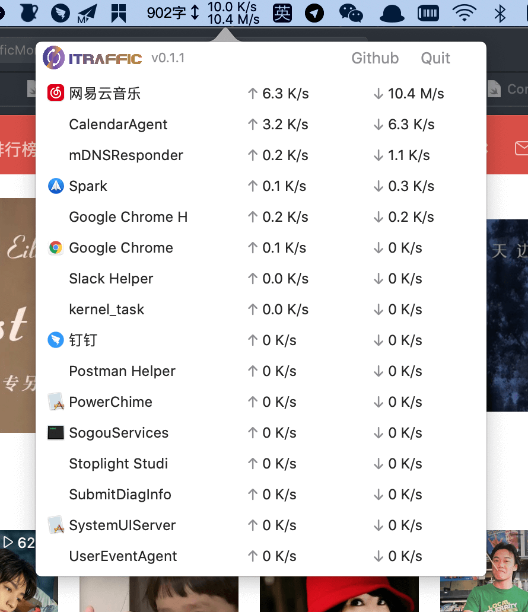

<div align="center">

# iTraffic 功能

iTraffic 只专注做好一件事：统计并展示本机的**总网络流量**。

## 核心功能

- 菜单栏常驻入口：实时总下载 / 上传速率，支持切换显示模式（双行 / 仅下行 / 仅上行 / 仅图标）
- 原生 macOS 仪表盘：折线 / 热力图 / 用量三种视图
- 本地 SQLite 历史流量记录，永久保留，不按天数自动清理
- 浅色 / 深色模式自适应
- 数据支持 CSV / JSON 导出
- 直接驱动系统 `nettop`，无需额外打包二进制

## 流量采集引擎

- **纯 Swift 驱动 `nettop`**：以 CSV 增量模式调用 `/usr/bin/nettop`，替代了原先打包的 Go 辅助二进制。
- **Delta 模式采样**：读取两次采样间的流量差，速率计算更准确。
- **仅统计非 loopback 接口**：`-t external` 即「所有非回环接口」，因此**包含局域网 / 组播流量**，并非仅 WAN。
- **防 CPU 空转**：通过 pseudo-TTY 包装并保持 stdin 打开，避免 nettop 在无终端环境下空转占满 CPU。
- **自动重启**：采集子进程异常退出后自动重启，保证监控不中断。

## 历史记录与仪表盘

流量按「分钟分桶」写入本地 SQLite（WAL 模式），永久保留。仪表盘为单个窗口，含三种视图：

| 视图                 | 功能                                                                                             |
| -------------------- | ------------------------------------------------------------------------------------------------ |
| **Line 折线**        | 所选范围（今天 / 7 天 / 30 天）的总流量曲线，配合下载 / 上传 / 总量 / 实时速率统计卡               |
| **Heatmap 热力图**   | 最近 365 天每日总流量热力图                                                                       |
| **Usage 用量**       | 全历史总量条形图，支持 天 / 月 / 季度 / 年 粒度与线性 / 对数刻度                                   |

## 数据导出

- **格式**：CSV / JSON。
- **粒度**：分钟 / 小时 / 天 / 月（分钟粒度限制在 1 天以内以保证文件体积合理）。
- **范围**：1 天 / 7 天 / 30 天 / 90 天。
- 导出字段为时间、下载字节数、上传字节数、总字节数——**纯总量，不含 App 维度**。

## 界面截图



## 说明

- 本应用只统计**总量**，不按 App / 进程拆分，也不做 VPN / 代理归属。
- `nettop -t external` 统计所有非 loopback 接口，包含局域网 / 组播流量。
- 解析失败的行会少计，设置页「采样诊断」会显示「解析失败行数」。

## 系统要求

macOS 14.0 或更高版本。

## 安装 & 更新

二选一：

1. 从[最新 GitHub Release](https://github.com/foamzou/ITraffic-monitor-for-mac/releases/latest) 下载 ZIP。
2. 使用 Homebrew 安装：

   ```bash
   brew install itraffic
   ```

   后续更新：

   ```bash
   brew update
   brew upgrade itraffic
   ```

## 从源码构建

工程由 `project.yml` 通过 [XcodeGen](https://github.com/yonaskolb/XcodeGen) 生成。

1. 安装 XcodeGen：`brew install xcodegen`
2. 生成工程：`xcodegen generate`
3. 打开 `ITrafficMonitorForMac.xcodeproj`

技术栈：Swift 5 + SwiftUI + Charts + SQLite3。

## 许可

参见 [LICENSE](./LICENSE)。
