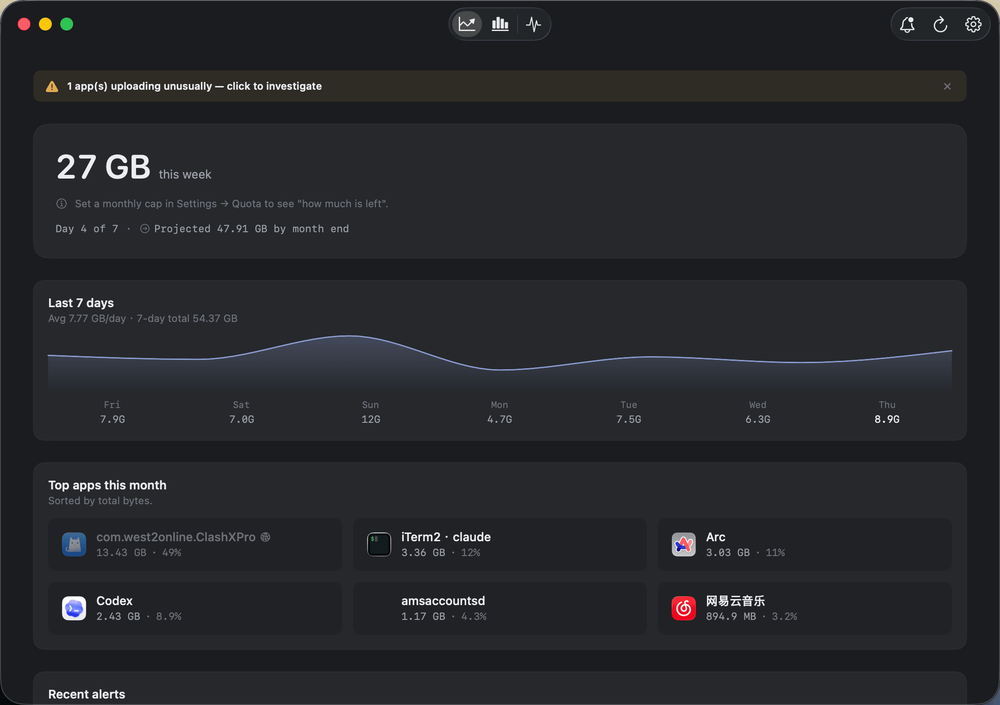
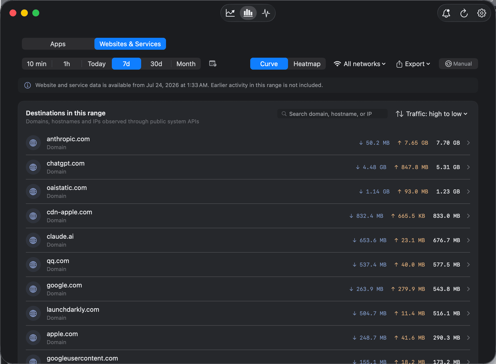
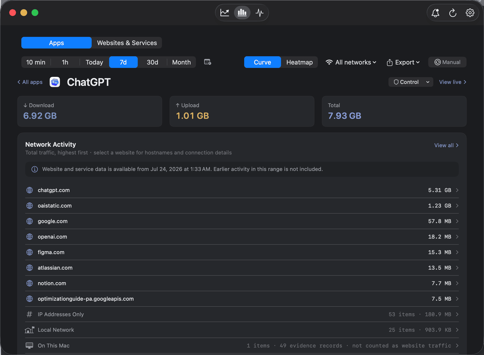
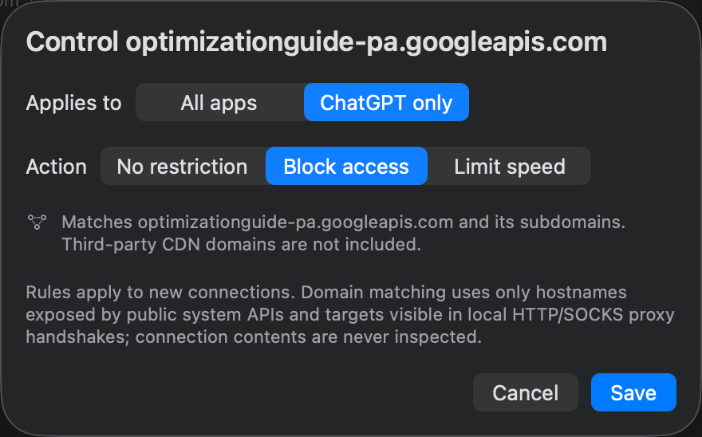
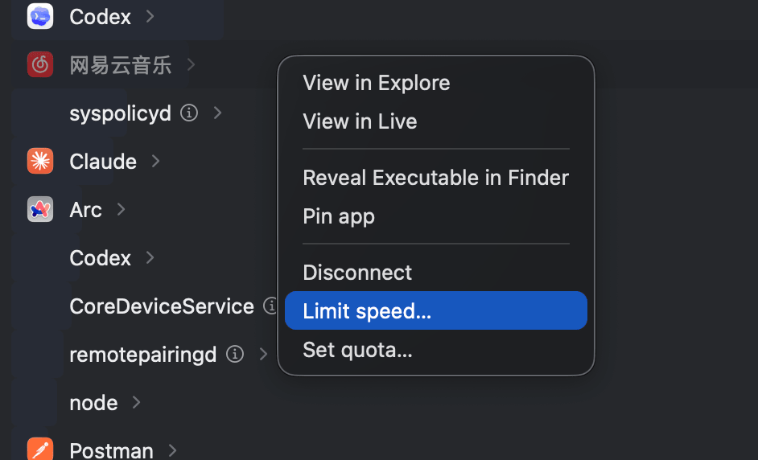
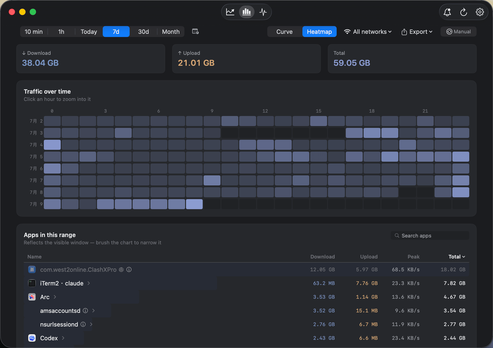
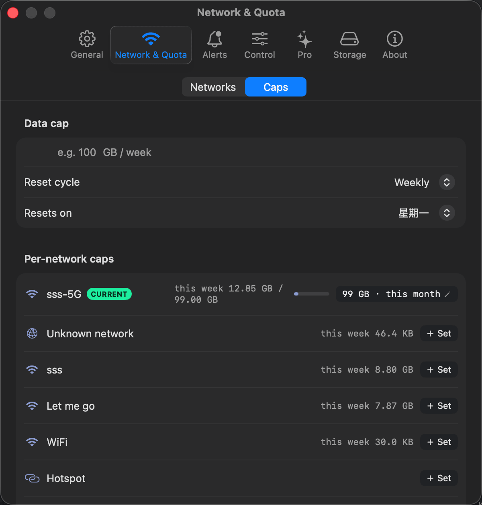
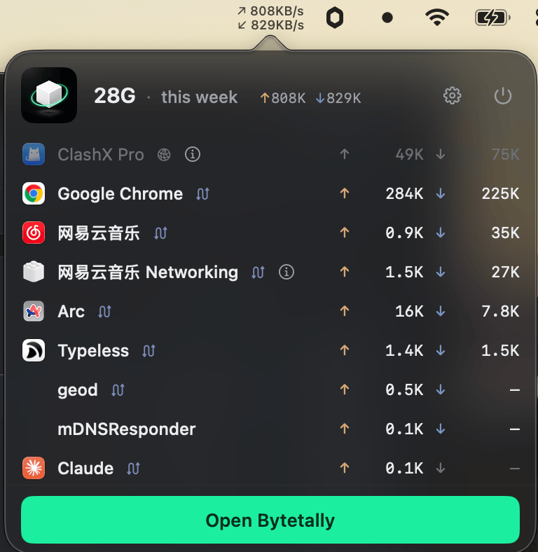

<div align="center">

# iTraffic for macOS

A lightweight, open-source per-process network speed monitor for your Mac menu bar.

[Download iTraffic](https://github.com/foamzou/ITraffic-monitor-for-mac/releases/latest)
· [Install with Homebrew](#install--update)
· [Meet Bytetally](https://bytetally.app/)

</div>

## Want more than a live speed meter?

**[Try Bytetally Free](https://bytetally.app/)** — the modern, separately developed commercial edition from the same developer.

Bytetally Free goes far beyond iTraffic's real-time list. It adds a native dashboard, month-to-date usage, a 7-day device trend, monthly top apps, live charts, app drill-down, and accurate attribution through VPNs and local proxies. Pro goes one dimension further and shows the websites and services behind the traffic. Core monitoring is free forever, with no account, and your network-usage data stays on your Mac.

<p align="center">
  <a href="https://bytetally.app/">
    
  </a>
  <br />
  <sub>Bytetally turns raw network activity into a clear timeline and shows which apps are responsible. Some features shown require Pro.</sub>
</p>

### Choose the version that fits you

| Capability | iTraffic OSS | Bytetally Free | Bytetally Pro |
|---|:---:|:---:|:---:|
| Source available to inspect and modify | ✅ | — | — |
| Minimum macOS version | 10.15 | 14 Sonoma | 14 Sonoma |
| Live upload/download by process or app | ✅ | ✅ | ✅ |
| Live rate in the menu bar | ✅ | ✅ | ✅ |
| Native dashboard and per-app live charts | — | ✅ | ✅ |
| Month overview, 7-day device trend, and monthly top apps | — | ✅ | ✅ |
| Attribution through VPNs and local proxies | — | ✅ | ✅ |
| Mac App Store install and full sandboxing | — | ✅ | ✅ |
| Long-range per-app rankings and traffic heatmap | — | — | ✅ |
| Websites and services behind the traffic, app → site and site → app | — | — | ✅ |
| Block or throttle one website, scoped to a single app | — | — | ✅ |
| Data caps and separate budgets for each Wi-Fi network | — | — | ✅ |
| Unusual-upload alerts | — | — | ✅ |
| Limit or block an app, automatic overage actions, CSV/JSON export | — | — | ✅ |

Choose **iTraffic** if you want a small, hackable open-source utility or need to support an older macOS release. Choose **Bytetally Free** if you want the stronger ready-to-use experience; upgrade only if you need deeper per-app history, budgets, alerts, control, or export.

<p align="center">
  <a href="https://bytetally.app/"><strong>Download Bytetally Free</strong></a>
  &nbsp;·&nbsp;
  <a href="https://bytetally.app/">Explore all features</a>
</p>

### A closer look

<p align="center">
  <a href="https://bytetally.app/#features"></a>
  <br />
  <sub><strong>Overview · Free</strong> — this week's total, a projection for month end, a 7-day trend and the month's top apps. A banner appears when an app starts uploading unusually.</sub>
</p>

<p align="center">
  <a href="https://bytetally.app/#pro"></a>
  <br />
  <sub><strong>Websites &amp; Services · Pro</strong> — every domain, hostname and IP your Mac talked to, ranked by traffic. Connections routed through a local proxy such as ClashX or Surge still resolve to the real destination.</sub>
</p>

<p align="center">
  <a href="https://bytetally.app/#pro"></a>
  <br />
  <sub><strong>App → destinations · Pro</strong> — open any app to see which websites it actually reached, then drill into hostnames and connection details. It works the other way round too: pick a website and see which apps reached it.</sub>
</p>

<table>
  <tr>
    <td width="50%" align="center" valign="top">
      <a href="https://bytetally.app/#pro"></a>
      <br />
      <sub><strong>Per-website rules · Pro</strong><br />Block or throttle a single host without cutting off the whole app, and scope the rule to one app or all of them.</sub>
    </td>
    <td width="50%" align="center" valign="top">
      <a href="https://bytetally.app/#pro"></a>
      <br />
      <sub><strong>Per-app control · Pro</strong><br />Right-click an app to disconnect it, set a smooth up/down speed limit, or give it its own data quota — no rules to write.</sub>
    </td>
  </tr>
  <tr>
    <td width="50%" align="center" valign="top">
      <a href="https://bytetally.app/#pro"></a>
      <br />
      <sub><strong>Full history · Pro</strong><br />Any custom range, an hour-by-day heatmap of when traffic peaked, and filtering by Wi-Fi network.</sub>
    </td>
    <td width="50%" align="center" valign="top">
      <a href="https://bytetally.app/#pro"></a>
      <br />
      <sub><strong>Caps &amp; budgets · Pro</strong><br />A monthly, weekly or daily cap, a separate budget for each Wi-Fi network, and an automatic cut-off or throttle when a cap runs out.</sub>
    </td>
  </tr>
</table>

<p align="center">
  <a href="https://bytetally.app/"></a>
  <br />
  <sub><strong>Menu bar · Free</strong> — the surface iTraffic users already know: live ↑↓ rates and who is responsible, without opening a window.</sub>
</p>

Bytetally Pro features include a free trial and can then be unlocked with a subscription or one-time lifetime purchase. [See current details on the Bytetally website.](https://bytetally.app/#pricing)

## About iTraffic

iTraffic keeps one job simple: show which processes are using your network right now.

- Per-process upload and download speeds
- Native macOS menu-bar interface
- Light and dark mode
- Direct Swift driver for macOS `nettop`
- Delta-mode sampling for more accurate live rates

## Requirements

macOS 10.15 Catalina or later.

## Install & update

Choose either option:

1. Download the ZIP from the [latest GitHub release](https://github.com/foamzou/ITraffic-monitor-for-mac/releases/latest).
2. Install with Homebrew:

   ```bash
   brew install itraffic
   ```

   To update later:

   ```bash
   brew update
   brew upgrade itraffic
   ```

## Build from source

This project is generated from `project.yml` with [XcodeGen](https://github.com/yonaskolb/XcodeGen).

1. Install XcodeGen: `brew install xcodegen`
2. Generate the project: `xcodegen generate`
3. Open `ITrafficMonitorForMac.xcodeproj`

## iTraffic screenshot


## Thanks

- [eul](https://github.com/gao-sun/eul) — an early reference while learning Swift

## License

See [LICENSE](./LICENSE).

## Star history

[](https://star-history.com/#foamzou/ITraffic-monitor-for-mac&Date)
